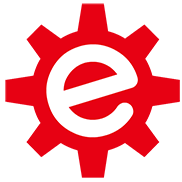

<p align="center">
  <a href="#readme">
    
  </a>
</p>

<h3 align="center">eBlock 6.0</h3>

<p align="center">
A Scratch-based application with which you can program a wide variety of devices (Arduino, STM32, SAMD51, ESP32, NRF5 ... and more ...)
  <br>
  <!--<a href="https://github.com/distintiva/eBlock-devices#readme"><strong>Avaliable Devices</strong></a>
  <br>-->
  <br>
  <a href="https://github.com/distintiva/eBlock-devices#readme">Avaliable devices</a>
  ·
  <a href="https://github.com/distintiva/eBlock/tree/latest">Download</a>
  ·
  <a href="https://github.com/distintiva/eBlock/issues">Request feature</a>
  ·
</p>


## Table of contents

- [Why eBlock](#why-eblock)
- [Status](#status)
- [New Features](#new-features)
- [Comming Features](#comming-features)
- [License](#license)


## Why eBlock

eBlock is based on the popular open source application [mBlock 3.4.5](https://github.com/Makeblock-official/mBlock) (a formidable work from Makeblock .Co, Ltd. company), many users still feel comfortable using that version of scratch due to simplicity.

And for those of us who prefer to continue programming in **c/c ++** instead of Python

Makeblock is no longer maintaining that version of mBlock and recent versions of mBlock are no longer opensource so we decided to create a fork of mBlock 3.4.5 to continue supporting and adding many interesting features.


## New Features
<details><summary><b>Unbranded</b></summary>
This means that you can customize eBlock to show any devices you want, all avaliable or only your custom robots
</details>

<details><summary><b>Portable</b></summary>

```text
eBlock/
├── media/
├── resources/    
|      ├── arduino/
|      ├── devices/
|      ├── drivers/
|      ├── extensions/
|      └── locale.xlsx
|
└───eBlock.exe

```

</details>

<details><summary><b>New design and more confortable colors</b></summary>
A modern look and feel, and new block colors to understand better the code
</details>

<details><summary><b>Categorized extension blocks</b></summary>
You can place your extension blocks to the corresponding category
</details>

<details><summary><b>Small download size</b></summary>
The size of eBlock is < 30MB
</details>

<details><summary><b>Multiple devices</b></summary>
Not only Arduino based boards now you can code  micro:bit, SAMD51, NRF5, STM32, ESP8266, ESP32 ... 
</details>

<details><summary><b>Device full customization</b></summary>
Each device can have one or more firmware to flash, it's own drivers to install or custom code templates to translate blocks
</details>

<details><summary><b>Evend driven code</b></summary>
Now you can code easily using device events, instead in putting all your code inside main loop.
</details>

<details><summary><b>Source code editor</b></summary>
You can manually edit the generated C/C++ code before uploading it to your device. It allows beginners to remove the fear of writing in source code 
</details>

<details><summary><b>Export your blocks as image</b></summary>
Export your code blocks as image PNG to easy share with others
</details>

<details><summary><b>String Variables</b></summary>
Use string variables and eBlock will detect and convert it to source code
</details>

<details><summary><b>List and arrays</b></summary>
You can work with lists and convert it to source code for uploading to your device/robot.  It opens a new world on programming more complex robot actions.
Lists can be also Strings
</details>


## Comming Features

- [ ] 64bit MacOS version
- [ ] Linux version
- [ ] New extensions
- [ ] Add more devices and extensions


### License
CC BY-NC-SA 4.0
