<p align="center">
  <a href="#readme">
    
  </a>
</p>

<h3 align="center">eBlock 6.0</h3>

<p align="center">
A Scratch-based application with which you can program a wide variety of devices (Arduino, STM32, SAMD51, ESP32, NRF5 ... and more ...)
  <br>
  <!--<a href="https://github.com/distintiva/eBlock-devices#readme"><strong>Avaliable Devices</strong></a>
  <br>-->
  <br>
  <a href="https://github.com/distintiva/eBlock-devices#readme">Avaliable devices</a>
  ·
  <a href="#download">Download</a>
  ·
  <a href="https://github.com/distintiva/eBlock/issues">Request feature</a>
  ·
</p>


## Table of contents

- [Why eBlock](#why-eblock)
- [Status](#status)
- [New Features](#new-features)
- [Comming Features](#comming-features)
- [License](#license)


## Why eBlock

eBlock is a fork of the popular open source application [mBlock 3.4.5](https://github.com/Makeblock-official/mBlock) (a formidable work from Makeblock .Co, Ltd. company) but Makeblock is no longer maintaining and supporting that version and the newest versions of mBlock are no longer open source  

Our team has built eBlock with the aim to **continue supporting it and adding a lot of new interesting features**.

And thinking of many users :
- That still prefer version of scratch due to simplicity.
- Those who prefer to continue programming in **c/c ++** instead of Python


## New Features


### New UI design and more confortable colors

A modern look and feel, and new block colors to understand better the code

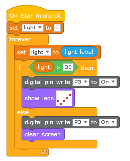

### Categorized extension blocks
You can place your extension blocks to the corresponding category

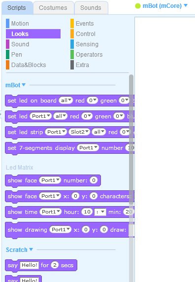


### String Variables
Use string variables and eBlock will detect and convert it to its corresponding source code

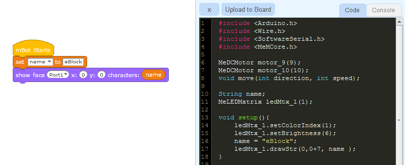


### List ( Arrays )
You can work with lists and eBlock will convert them to source too. It opens a new world on programming more complex robot actions.
**Lists items can be numbers or Strings**

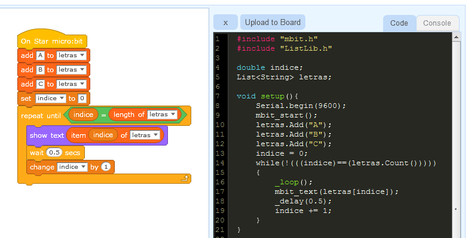

### RTTTL tones

RTTTL is a melody format developed by Nokia some years ago.  It allows to transfer songs in a easy way.

[RTTTL on wikipedia](<https://en.wikipedia.org/wiki/Ring_Tone_Transfer_Language>)

You can play a song in background while your robot is moving or doing any action.


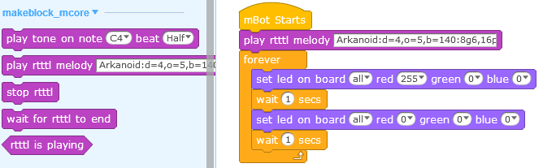

or you can wait  for rtttl tone to end

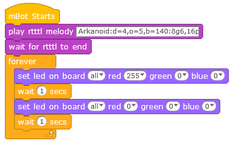

### New matrix editor and Block
Now matrix editor allow to use a 5x5 matrix ( for example to use with BBC micro:bit )  

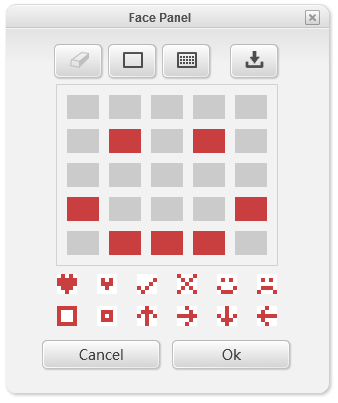

and a new matrix block that shows you better the matrix thumbnail

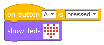

### Source code viewer and editor
New dark theme, and bigger to review your code easilly.

Now you can **edit** the generated C/C++ code before uploading it to your device. It allows beginners to remove the fear of writing in source code 

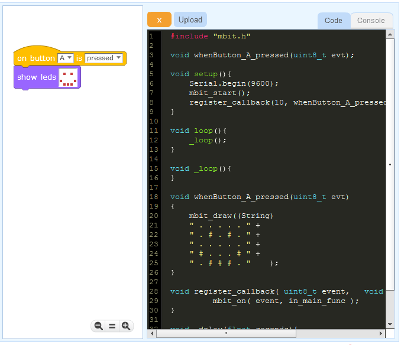

### New console
The output console has moved it's possition,  access it only if you want

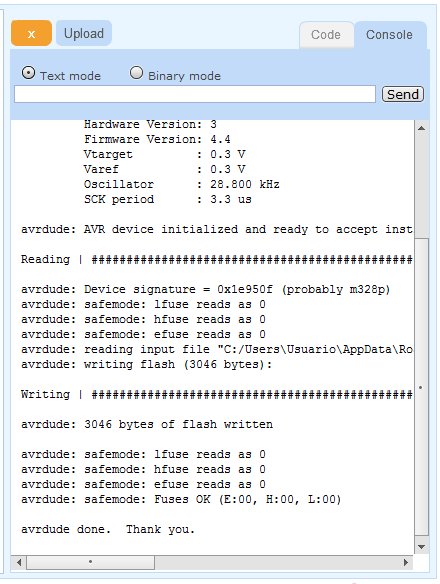

### Event driven code
Now you can code easily using device events, instead in putting all your code inside main loop.

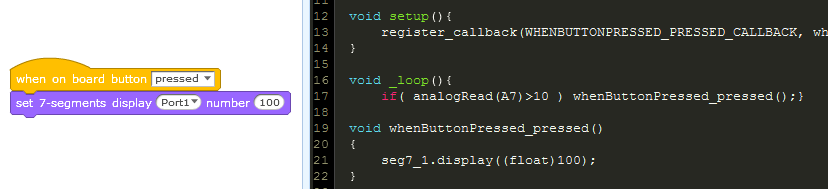


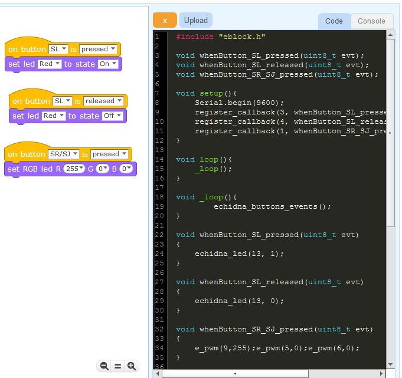


### Export your blocks as image
Export your code blocks as image PNG to easy share with others, make documentation or upload to your web

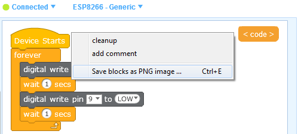

### Portable


### Removed user tracking code
We have removed all user tracking code because mBlock tracks almost every user action and sends it to Google Analitycs.
eBlock uses only one remote call at startup to check for new version. And never sends any parameter or user data.


### Small download size
The size of eBlock is < 30MB


### Multiple devices
Not only Arduino based boards now you can code  micro:bit, SAMD51, NRF5, STM32, ESP8266, ESP32 ... 


### Full device customization

Each device can have one or more firmware to flash, it's own drivers to install or custom code templates to translate blocks


### New extension system 
Also is backward compatble with existing mBlock extensions.

Now you can place synchronous calls inside a JavaScript extension functions. For example get a value from your device and make some calculations before submitin to Scratch

```javascript
ext.getJoystick = function(nextID, coord){
    
    if(coord=="x"){
      ret = device.get_analog_perc(0);
    }else{
      ret = device.get_analog_perc(1);
    } 
    
    responseValue(ret-48);
  };
```


### New Scratch native blocks 
 - **map:** Maps a value between 2 source low and high value to a dest low and high value


## Download

Portable version, no installer, only unzip and exec **eBlock.exe** 
Download the latest eBlock version from:

[eBlock-windows (27Mb)](https://github.com/distintiva/eBlock/releases/download/latest/eBlock-win.zip)


## Comming Features

- [ ] 64bit MacOS version
- [ ] Linux version
- [ ] New extensions
- [ ] Add more devices and extensions


### License
CC BY-NC-SA 4.0
