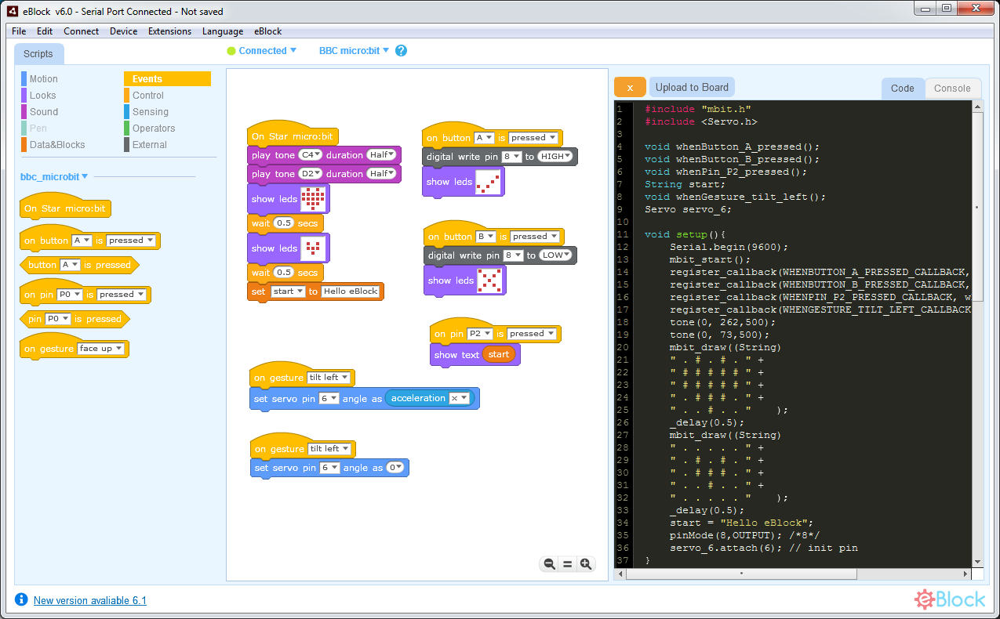

<h1 align="center"> </h1>
eBlock is an application that allows you code all kinds of devices, is a enhanced versión of <a href="https://github.com/Makeblock-official/mBlock" target="_blank">mBlock 3.4.5/Scratch</a>
<h1>&nbsp;</h1>

	<strong>
		<a href="#features">Features</a>
		•
		<a href="#installation">Installation</a>
	</strong>

<h1>&nbsp;</h1>

### Note!!
This repo has been recently created and the app still is in **beta version** so we need to upload more documentation.

Please be patient, because behing this app there is a lot of work (app, new libraries, new extensions ...) 

## Features

<b>Unbranded</b>

This means that you can customize eBlock to show any devices you want, all avaliable or only your custom robots

<b>Portable</b>

All the application files in the same application directory that allows you to customize eBlock in the easy way

<b>New design and more confortable colors</b>

A modern look and feel, and new block colors to understand better the code

<b>Categorized extension blocks</b>

You can place your extension blocks to the corresponding category

<b>Small download size</b>

The size of eBlock is < 30MB

<b>Multiple devices</b>

Not only Arduino based boards now you can code  micro:bit, SAMD51, NRF5, STM32, ESP8266, ESP32 ... 

<b>Device full customization</b>

Each device can have one or more firmware to flash, it's own drivers to install or custom code templates to translate blocks

<b>Evend driven code</b>

Now you can code easily using device events, instead in putting all your code inside main loop.

<b>Source code editor</b>

You can manually edit the generated C/C++ code before uploading it to your device. It allows beginners to remove the fear of writing in source code 

<b>Export your blocks as image</b>

Export your code blocks as image PNG to easy share with others

<b>String Variables</b>

Use string variables and eBlock will detect and convert it to source code

<b>List and arrays</b>

You can work with lists and convert it to source code for uploading to your device/robot.  It opens a new world on programming more complex robot actions.
Lists can be also Strings

## Comming Features

- [ ] 64bit MacOS version
- [ ] Linux version
- [ ] New extensions
- [ ] Add more devices and extensions

### Installation
Go to releases section 

### License
CC BY-NC-SA 4.0

